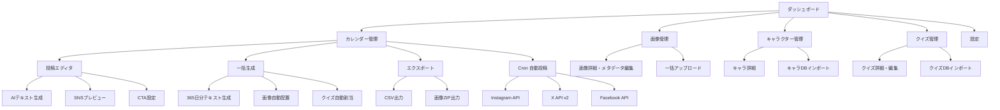

# 気良歌舞伎 SNS365 — アプリ仕様書
## Claude Code 開発用スペック

---

## 1. プロジェクト概要

### アプリ名
**KABUKI POST 365**（仮）

### 目的
岐阜県郡上市の地歌舞伎「気良歌舞伎（けらかぶき）」のブロマイド画像と、KABUKI NAVI 人物ガイドのキャラクターデータ（132キャラ）を活用し、Instagram・X・Facebookに365日毎日投稿するコンテンツを一括管理・生成・運用するWebアプリケーション。

同時に、KABUKI PLUS+（歌舞伎を、もっと面白く。）のPR・認知拡大の導線としても機能させる。

### ターゲットユーザー
- 澤奈央也（管理者・唯一の運用者）
- 将来的に気良歌舞伎メンバーへの展開も視野

---

## 2. 技術スタック

### フロントエンド
- **React**（Vite）
- **Tailwind CSS**
- **shadcn/ui** コンポーネント
- カレンダーUI：`react-big-calendar` or `@fullcalendar/react`
- ドラッグ&ドロップ：`@dnd-kit/core`

### バックエンド
- **Cloudflare Workers**（既存のKABUKI NAVI/けらのすけと同じスタック）
- **Cloudflare D1**（SQLiteベースDB）
- **Cloudflare R2**（画像ストレージ）
- **Cloudflare KV**（キャッシュ・設定値）

### AI連携
- **Anthropic Claude API**（投稿テキスト生成）
- **Dify**（けらのすけ知識ベース参照、フォールバック）

### 外部API（Phase 3・すべて無料枠）
- **Meta Graph API**（Instagram + Facebook 投稿・無料）
- **X API v2 Free tier**（月500投稿まで無料）

---

## 3. データベース設計（Cloudflare D1）

### characters テーブル（KABUKI NAVI 人物ガイド連携）
```sql
CREATE TABLE characters (
  id INTEGER PRIMARY KEY AUTOINCREMENT,
  name TEXT NOT NULL,              -- 例：助六
  name_reading TEXT,               -- 例：すけろく
  aliases TEXT,                    -- JSON配列：別名リスト
  related_play TEXT NOT NULL,      -- 関連演目
  description TEXT NOT NULL,       -- けらのすけ風の解説文
  personality_tags TEXT,           -- JSON配列：["色男","荒事","江戸っ子"]
  season_tags TEXT,                -- JSON配列：["通年"] or ["夏","怪談"]
  related_characters TEXT,         -- JSON配列：関連キャラID
  kabuki_navi_url TEXT,           -- KABUKI NAVIの該当ページURL
  created_at DATETIME DEFAULT CURRENT_TIMESTAMP,
  updated_at DATETIME DEFAULT CURRENT_TIMESTAMP
);
```

### images テーブル
```sql
CREATE TABLE images (
  id INTEGER PRIMARY KEY AUTOINCREMENT,
  filename TEXT NOT NULL,
  r2_key TEXT NOT NULL,            -- R2ストレージのキー
  original_width INTEGER,
  original_height INTEGER,
  character_id INTEGER,            -- 紐付くキャラ（NULLの場合は未分類）
  play_name TEXT,                  -- 演目名
  scene_type TEXT,                 -- 見得/立廻り/口説き/舞踊 等
  visual_features TEXT,            -- JSON：隈取り種類、衣装色、小道具等
  season_tag TEXT DEFAULT '通年',
  usage_count INTEGER DEFAULT 0,   -- 使用回数トラッキング
  last_used_date DATE,             -- 最後に使用した日付
  memo TEXT,                       -- 管理者メモ
  needs_review BOOLEAN DEFAULT 0,  -- 要確認フラグ
  FOREIGN KEY (character_id) REFERENCES characters(id)
);
```

### posts テーブル
```sql
CREATE TABLE posts (
  id INTEGER PRIMARY KEY AUTOINCREMENT,
  post_date DATE NOT NULL,
  day_of_week TEXT NOT NULL,       -- 月〜日
  theme TEXT NOT NULL,             -- 曜日テーマ
  image_id INTEGER NOT NULL,
  character_id INTEGER,
  special_day TEXT,                -- 祝日・記念日
  
  -- SNS別テキスト
  instagram_text TEXT,
  instagram_hashtags TEXT,
  x_text TEXT,
  x_hashtags TEXT,
  facebook_text TEXT,
  facebook_hashtags TEXT,
  
  -- KABUKI PLUS+ PR
  cta_type TEXT DEFAULT 'standard', -- standard/play/character/event
  cta_url TEXT,                     -- KABUKI PLUS+のリンク先
  
  -- ステータス管理
  status TEXT DEFAULT 'draft',      -- draft/approved/scheduled/posted
  instagram_posted BOOLEAN DEFAULT 0,
  x_posted BOOLEAN DEFAULT 0,
  facebook_posted BOOLEAN DEFAULT 0,
  
  -- AI生成メタ
  ai_generated BOOLEAN DEFAULT 1,
  manually_edited BOOLEAN DEFAULT 0,
  
  created_at DATETIME DEFAULT CURRENT_TIMESTAMP,
  updated_at DATETIME DEFAULT CURRENT_TIMESTAMP,
  FOREIGN KEY (image_id) REFERENCES images(id),
  FOREIGN KEY (character_id) REFERENCES characters(id)
);
```

### quiz_posts テーブル（金曜クイズ専用）
```sql
CREATE TABLE quiz_posts (
  id INTEGER PRIMARY KEY AUTOINCREMENT,
  post_id INTEGER NOT NULL,        -- postsテーブルのID
  question TEXT NOT NULL,
  option_1 TEXT NOT NULL,
  option_2 TEXT NOT NULL,
  option_3 TEXT NOT NULL,
  correct_answer INTEGER NOT NULL,  -- 1/2/3
  explanation TEXT,                 -- 解答解説
  difficulty TEXT DEFAULT 'beginner', -- beginner/intermediate/advanced
  category TEXT,                    -- 演目/技法/歴史/役者 等
  answer_post_id INTEGER,          -- 翌週の回答投稿ID
  FOREIGN KEY (post_id) REFERENCES posts(id)
);
```

### settings テーブル
```sql
CREATE TABLE settings (
  key TEXT PRIMARY KEY,
  value TEXT NOT NULL
);
-- 初期データ例：
-- start_date: "2026-04-01"
-- kabuki_plus_base_url: "https://..."
-- kabuki_navi_base_url: "https://..."
-- common_hashtags: "#気良歌舞伎 #けらかぶき #地歌舞伎 ..."
```

---

## 4. 機能仕様

### 4.1 ダッシュボード（トップ画面）

**表示項目：**
- 今日の投稿プレビュー（3SNS並列表示）
- 今週の投稿カレンダー（ミニビュー）
- ステータスサマリー：投稿済み / 承認済み / 下書き / 未作成
- 画像使用率：全画像中のユニーク使用率
- 直近のアラート（同一画像の使いすぎ、未割り当て日など）

### 4.2 カレンダー管理画面

**月間カレンダービュー：**
- 各日にサムネイル画像＋テーマアイコン表示
- ステータス色分け（下書き=グレー、承認済み=ゴールド、投稿済み=グリーン）
- 日付クリックで投稿詳細・編集パネルを開く
- ドラッグ&ドロップで投稿日の入れ替え

**自動配置ルール：**
- 同一画像の使用間隔：最低30日
- 季節マッチング：spring/summer/autumn/winter タグと月の対応
- 特別日の自動検出：祝日、歌舞伎の日（2/20）、地歌舞伎イベント日

**曜日別テーマ：**
| 曜日 | テーマ | コンテンツソース |
|------|--------|----------------|
| 月 | 今週の演目紹介 | キャラDB → related_play |
| 火 | 役者・役柄クローズアップ | キャラDB → description |
| 水 | 歌舞伎豆知識 | けらのすけFAQ |
| 木 | ブロマイド名場面 | 画像DB → scene_type |
| 金 | 歌舞伎クイズ | quiz_postsテーブル |
| 土 | 舞台裏・衣装・小道具 | 画像DB → visual_features |
| 日 | 気良歌舞伎ヒストリー | けらのすけ知識ベース |

### 4.3 投稿エディタ

**レイアウト：**
左側にブロマイド画像プレビュー、右側にSNS別の投稿テキスト編集エリアを3タブ（Instagram / X / Facebook）で表示。

**AI生成機能：**
- 「テキスト生成」ボタン → Claude APIでキャラ情報+画像メタデータから投稿文を自動生成
- 「再生成」ボタン → トーン変更（もっと親しみやすく / もっと詳しく / もっと短く）
- SNSごとに独立して再生成可能

**KABUKI PLUS+ CTA自動挿入：**
各投稿テキストの末尾に、SNSに最適化されたCTAを自動追加。

```
【Instagram】
🎭 この人物の詳しい解説は KABUKI PLUS+ で
→ プロフィールのリンクから

【X】
💡詳しくは → KABUKI PLUS+｜歌舞伎を、もっと面白く。
{kabuki_plus_url}

【Facebook】
━━━━━━━━━━━━
📖 KABUKI PLUS+ ― 歌舞伎を、もっと面白く。
{character_name}のさらに詳しい解説、演目の全体像、
他の登場人物との相関関係はこちら 👇
🔗 {kabuki_plus_url}
━━━━━━━━━━━━
```

**CTAバリエーション（cta_type別）：**
- `standard`：人物ガイドへの汎用誘導
- `character`：特定キャラの詳細ページへ
- `play`：演目解説ページへ
- `event`：公演・イベント告知ページへ
- `navi`：観劇ナビへの誘導（初心者向け投稿時）

**プレビュー機能：**
- Instagram：1080×1080正方形枠内でのプレビュー
- X：1200×675横長カード風プレビュー
- Facebook：1200×630プレビュー
- 文字数カウンター（各SNS上限に対する残り文字数）

### 4.4 画像管理画面

**一覧表示：**
- グリッドビュー（サムネイル一覧）
- キャラクター紐付けステータス表示（紐付済み/未分類）
- フィルター：演目別、キャラ別、季節別、使用回数順
- 要確認フラグ付き画像のハイライト

**画像詳細：**
- メタデータ編集（演目、キャラ紐付け、季節タグ等）
- 使用履歴（いつの投稿で使われたか）
- 使用回数と最終使用日

**画像アップロード：**
- ドラッグ&ドロップで一括アップロード
- R2ストレージに保存
- アップロード時にキャラ候補をAIで推定（Claude Vision）

### 4.5 キャラクター管理画面

**一覧：**
- KABUKI NAVIの132キャラ一覧
- 演目別グループ表示
- 紐付き画像枚数表示
- KABUKI NAVI / KABUKI PLUS+へのリンク

**キャラ詳細：**
- けらのすけ風の解説テキスト
- 関連キャラクター（相関図風表示）
- 紐付きブロマイド画像一覧
- このキャラが登場する投稿一覧

**インポート機能：**
- けらのすけのキャラDBからJSON/CSVインポート
- KABUKI NAVIのキャラデータとの同期

### 4.6 クイズ管理画面（金曜投稿用）

**クイズ一覧：**
- けらのすけの100問クイズデータをインポート
- 難易度別（初級/中級/上級）フィルター
- カテゴリ別（演目/技法/歴史/役者/etc.）フィルター
- 使用済み/未使用ステータス

**クイズ投稿フロー：**
1. 金曜の投稿に自動でクイズを割り当て
2. 投稿テキスト：問題文 + 3択 + 「答えは来週金曜に！」
3. 翌週金曜の冒頭に「先週の答え」を自動挿入
4. 関連するブロマイド画像を自動マッチング

### 4.7 一括生成機能

**365日分一括生成：**
1. 開始日を指定
2. 画像の自動配置（季節マッチング + 使用間隔ルール適用）
3. Claude APIで全投稿テキストを一括生成
4. クイズの自動割り当て（出題→回答の対応付き）
5. KABUKI PLUS+ CTAの自動挿入
6. 生成完了後、カレンダー画面で確認・微調整

**生成プロンプトテンプレート（Claude API呼び出し用）：**
```
あなたは岐阜県郡上市の地歌舞伎「気良歌舞伎」のSNS担当者です。
以下の情報をもとに、{sns_platform}向けの投稿テキストを生成してください。

【投稿日】{date}（{day_of_week}）
【テーマ】{theme}
【使用画像の情報】
- 演目：{play_name}
- 役名：{character_name}
- 場面：{scene_type}
- ビジュアル特徴：{visual_features}

【キャラクター解説（参考）】
{character_description}

【SNSガイドライン】
- プラットフォーム：{platform}
- 文字数：{char_limit}
- トーン：{tone_guide}
- ハッシュタグ数：{hashtag_count}

【必須要素】
- 歌舞伎初心者にもわかる平易な表現を使う
- 歌舞伎用語には括弧で読みと簡単な説明を添える
- KABUKI PLUS+への誘導CTAを末尾に含める
- 共通ハッシュタグ：#気良歌舞伎 #けらかぶき #地歌舞伎 #歌舞伎 #郡上 #岐阜 #伝統芸能
```

### 4.8 エクスポート機能

**CSV出力：**
- SNS別の投稿テキスト+画像ファイル名+日時のCSV
- Meta Business Suite / SocialDog / Buffer等のインポート形式に対応
- 月単位・週単位でのエクスポート選択

**画像一括出力：**
- SNS別に最適化されたサイズの画像をZIPでダウンロード
- Instagram: 1080×1080px
- X: 1200×675px
- Facebook: 1200×630px

---

## 5. KABUKI PLUS+ PR戦略の組み込み

### 5.1 PR導線の種類

**A. 人物ガイド誘導（メイン）**
投稿キャラ → KABUKI NAVIの人物ガイド詳細ページ
「この人物のさらに詳しい解説はKABUKI PLUS+で」

**B. 演目解説誘導**
投稿演目 → KABUKI NAVIの演目解説ページ
「この演目の全体のあらすじ・見どころはKABUKI PLUS+で」

**C. 観劇ナビ誘導（初心者向け）**
水曜の豆知識・日曜のヒストリー投稿時
「歌舞伎を観てみたくなったら → 観劇ナビ」

**D. けらのすけ誘導**
金曜のクイズ投稿時
「もっとクイズに挑戦したい？ → けらのすけに話しかけてみて」

**E. イベント告知**
公演日の前後
「次の公演情報はこちら」

### 5.2 PR配分ルール
- 月〜木：人物ガイド or 演目解説（A/B）→ 70%
- 金：けらのすけ誘導（D）→ 固定
- 土：人物ガイド（A）→ 固定
- 日：観劇ナビ（C）→ 固定
- 公演前後2週間：イベント告知（E）を優先挿入

### 5.3 UTMパラメータ管理
全リンクにUTMを付与して効果測定
```
{kabuki_plus_url}?utm_source={platform}&utm_medium=social&utm_campaign=sns365&utm_content={post_id}
```

---

## 6. KABUKI NAVI 人物ガイド画像連携

### 6.1 コンセプト：1アップロード → 2プラットフォーム活用

ブロマイド画像をCloudflare R2に保存し、同じ画像ソースを「KABUKI POST 365（SNS投稿管理）」と「KABUKI NAVI（人物ガイド）」の両方で参照する。画像の二重管理を排除し、一度の作業で両方のコンテンツが充実する。

```
                    ┌─────────────────────┐
                    │   Cloudflare R2     │
                    │   画像ストレージ     │
                    │                     │
                    │  /bromide/001.jpg   │
                    │  /bromide/002.jpg   │
                    │  /bromide/...       │
                    └────────┬────────────┘
                             │
                ┌────────────┼────────────┐
                │                         │
                ▼                         ▼
   ┌────────────────────┐   ┌────────────────────┐
   │  KABUKI POST 365   │   │    KABUKI NAVI     │
   │  SNS投稿管理アプリ  │   │    人物ガイド       │
   │                    │   │                    │
   │ ・Instagram投稿用   │   │ ・キャラ詳細ページ   │
   │ ・X投稿用          │   │ ・演目一覧ページ     │
   │ ・Facebook投稿用    │   │ ・検索結果表示       │
   └────────────────────┘   └────────────────────┘
```

### 6.2 R2画像パス設計

```
kabuki-images/
├── originals/              ← アップロード原本
│   ├── {image_id}.jpg
│   └── ...
├── sns/                    ← SNS投稿用（自動リサイズ）
│   ├── instagram/          ← 1080×1080
│   ├── x/                  ← 1200×675
│   └── facebook/           ← 1200×630
├── navi/                   ← KABUKI NAVI表示用（自動リサイズ）
│   ├── card/               ← 一覧カード用 400×400
│   ├── detail/             ← 詳細ページ用 800×auto
│   └── thumb/              ← サムネイル用 120×120
└── credit/                 ← クレジット入り（SNS用）
    ├── instagram/
    ├── x/
    └── facebook/
```

**画像アップロード時の自動処理フロー：**
1. 管理者が原本をアップロード → `originals/` に保存
2. Workers が自動リサイズを実行
   - SNS用3サイズ → `sns/` 配下に保存
   - NAVI用3サイズ → `navi/` 配下に保存
   - クレジット入りSNS用 → `credit/` 配下に保存
3. D1の `images` テーブルにメタデータ保存
4. キャラ紐付けがあれば、KABUKI NAVIのキャラページに即座に反映

### 6.3 images テーブル拡張

```sql
-- 既存カラムに追加
ALTER TABLE images ADD COLUMN navi_display_order INTEGER DEFAULT 0;  -- NAVI上の表示順
ALTER TABLE images ADD COLUMN navi_caption TEXT;                     -- NAVI用キャプション
ALTER TABLE images ADD COLUMN navi_visible BOOLEAN DEFAULT 1;       -- NAVI表示フラグ
ALTER TABLE images ADD COLUMN is_primary BOOLEAN DEFAULT 0;         -- キャラ代表画像フラグ
```

**`is_primary` の用途：**
- キャラクターに複数のブロマイドが紐付く場合、代表の1枚を指定
- KABUKI NAVIの人物ガイド一覧ページでサムネイルとして表示
- SNS投稿でもそのキャラ初回登場時に代表画像を優先使用

### 6.4 KABUKI NAVI 人物ガイドの表示変更

**現在のキャラ詳細ページ：**
テキストのみ（けらのすけ風の解説）

**変更後のキャラ詳細ページ：**
```
┌─────────────────────────────────┐
│  ┌─────────┐                    │
│  │代表画像  │  助六（すけろく）   │
│  │(primary) │  演目：助六由縁江戸桜│
│  │          │                    │
│  └─────────┘                    │
│                                 │
│  けらのすけ解説テキスト...         │
│                                 │
│  📸 ブロマイドギャラリー          │
│  ┌────┐ ┌────┐ ┌────┐ ┌────┐  │
│  │img1│ │img2│ │img3│ │img4│  │
│  └────┘ └────┘ └────┘ └────┘  │
│                                 │
│  👥 関連キャラクター              │
│  ┌────┐ ┌────┐ ┌────┐         │
│  │揚巻│ │意休│ │白酒│         │
│  └────┘ └────┘ └────┘         │
│                                 │
│  🎭 この演目の他のキャラ →       │
│  📖 KABUKI PLUS+で詳しく見る →  │
└─────────────────────────────────┘
```

**人物ガイド一覧ページ：**
```
┌──────────────────────────────────────┐
│  人物ガイド ― 132人の歌舞伎キャラ     │
│                                      │
│  🔍 [演目で探す ▼] [キーワード検索]    │
│                                      │
│  ┌──────────┐  ┌──────────┐          │
│  │ ┌──────┐ │  │ ┌──────┐ │          │
│  │ │代表  │ │  │ │代表  │ │          │
│  │ │画像  │ │  │ │画像  │ │          │
│  │ └──────┘ │  │ └──────┘ │          │
│  │ 助六     │  │ 弁慶     │          │
│  │ 助六由縁..│  │ 勧進帳   │          │
│  └──────────┘  └──────────┘          │
│                                      │
│  ┌──────────┐  ┌──────────┐          │
│  │ ┌──────┐ │  │ ┌──────┐ │          │
│  │ │代表  │ │  │ │代表  │ │          │
│  │ │画像  │ │  │ │画像  │ │          │
│  │ └──────┘ │  │ └──────┘ │          │
│  │ お富     │  │ 由良之助  │          │
│  │ 切られ与三│  │ 忠臣蔵   │          │
│  └──────────┘  └──────────┘          │
└──────────────────────────────────────┘
```

### 6.5 KABUKI NAVI Worker API 追加エンドポイント

KABUKI NAVIの既存worker.jsに以下のAPIを追加：

```javascript
// キャラクターの画像一覧を取得
GET /api/characters/{character_id}/images
→ Response: [
    {
      id: 1,
      url: "https://r2.kabuki-navi.com/navi/detail/001.jpg",
      thumb_url: "https://r2.kabuki-navi.com/navi/thumb/001.jpg",
      is_primary: true,
      caption: "助六 見得の場面",
      scene_type: "見得",
      play_name: "助六由縁江戸桜"
    },
    ...
  ]

// キャラクター代表画像を取得（一覧表示用）
GET /api/characters/{character_id}/primary-image
→ Response: {
    url: "https://r2.kabuki-navi.com/navi/card/001.jpg",
    thumb_url: "https://r2.kabuki-navi.com/navi/thumb/001.jpg"
  }

// 画像のR2直接配信（CDN経由）
GET /images/navi/{size}/{image_id}.jpg
→ R2から直接配信（Cloudflare CDNキャッシュ活用）
```

### 6.6 画像管理の統合ワークフロー

```
管理者の作業フロー：

1. ブロマイド画像をアップロード（KABUKI POST 365 管理画面）
   ↓
2. キャラクターに紐付け + 代表画像を指定
   ↓
3. 自動で以下が同時に起きる：
   ├── SNS用リサイズ画像が生成される
   ├── KABUKI NAVI用リサイズ画像が生成される
   ├── KABUKI NAVIの人物ガイドにブロマイドが表示される ← NEW!
   ├── 365日カレンダーの画像候補に追加される
   └── Claude APIがキャラ情報を参照して投稿テキスト生成可能に
   
4. 結果：
   ✅ SNS投稿コンテンツができる
   ✅ KABUKI NAVIの人物ガイドが画像付きでリッチになる
   ✅ KABUKI PLUS+のPR導線が強化される
   ✅ SNS → KABUKI NAVI → KABUKI PLUS+ の導線が画像で繋がる
```

### 6.7 相互誘導の強化

**SNS → KABUKI NAVI：**
「この人物の詳しい解説＋他のブロマイドはKABUKI NAVIで → {url}」

**KABUKI NAVI → SNS：**
キャラ詳細ページに「📱 SNSでも毎日歌舞伎情報を配信中 → フォローする」ボタン

**SNS → けらのすけ：**
「このキャラについてもっと知りたい？けらのすけに聞いてみて → {line_url}」

**循環導線の全体像：**
```
SNS投稿（毎日）
  │ CTA: 「詳しくはKABUKI NAVIで」
  ▼
KABUKI NAVI 人物ガイド（画像付き）
  │ リンク: 「KABUKI PLUS+で演目全体を見る」
  ▼
KABUKI PLUS+
  │ リンク: 「けらのすけに質問する」
  ▼
けらのすけ（LINE / Web）
  │ 回答内: 「SNSもフォローしてね」
  ▼
SNS投稿（ループ）
```

---

### 6.8 画面遷移図



---

## 7. 開発フェーズ

### Phase 1（MVP — 目標：1〜2日）
Claude Codeで一気に構築する最小限の動くアプリ。

- [ ] プロジェクトセットアップ（Vite + React + Tailwind + Cloudflare Workers）
- [ ] D1データベース作成（全テーブル + NAVI連携カラム）
- [ ] R2画像ストレージ設定（originals / sns / navi / credit のパス構成）
- [ ] 画像アップロード → R2保存 → 自動リサイズ（SNS用3種 + NAVI用3種）
- [ ] キャラDBインポート（JSON/CSV）+ 代表画像設定機能
- [ ] 365日カレンダー自動生成（曜日テーマ＋季節マッチング）
- [ ] Claude APIで投稿テキスト一括生成
- [ ] KABUKI PLUS+ CTA自動挿入
- [ ] カレンダー画面（月間ビュー＋投稿詳細表示）
- [ ] CSV一括エクスポート
- [ ] **KABUKI NAVI用API追加**（キャラ画像取得 / 代表画像取得 / R2画像配信）
- [ ] **KABUKI NAVI人物ガイドに画像表示を組み込み**（代表画像 + ギャラリー）

### Phase 2（運用改善 — 目標：数日）
- [ ] 投稿エディタ（テキスト編集＋AI再生成）
- [ ] SNS別プレビュー表示
- [ ] ドラッグ&ドロップで投稿並び替え
- [ ] 画像使用回数トラッキング＋重複アラート
- [ ] クイズ管理（出題→回答の自動対応）
- [ ] ステータス管理（draft/approved/scheduled/posted）
- [ ] UTMパラメータ自動付与
- [ ] **KABUKI NAVIキャラ詳細ページのギャラリーUI改善**
- [ ] **NAVI人物ガイド一覧のカード画像表示**
- [ ] **NAVI ↔ SNS相互誘導リンクの設置**

### Phase 3（自動投稿・拡張）
- [ ] **各SNS API直接連携による自動投稿**（詳細はセクション8参照）
- [ ] Meta Graph API連携（Instagram + Facebook）
- [ ] X API v2 Free連携
- [ ] Cloudflare KV トークン自動更新
- [ ] 管理画面にOAuth連携ページ追加
- [ ] Cloudflare Workers Cron Trigger による毎日自動投稿
- [ ] 投稿失敗時のLINE通知
- [ ] エンゲージメント分析ダッシュボード
- [ ] けらのすけ知識ベースとのリアルタイム連携
- [ ] 画像AI分析（Claude Vision）でメタデータ自動推定
- [ ] 多言語対応（英語投稿の生成）
- [ ] **SNS → NAVI → PLUS+ → けらのすけ の循環導線分析**
- [ ] **KABUKI NAVIの関連キャラ画像によるレコメンド表示**

---

---

## 8. SNS自動投稿（各API直接連携・無料）

### 8.1 アーキテクチャ

各SNSの公式API無料枠を直接利用。外部サービスへの依存・月額コストなし。

```
┌──────────────────────────────────────────────────────┐
│              KABUKI POST 365                          │
│                                                      │
│  ┌──────────┐  ┌──────────┐  ┌───────────────────┐  │
│  │ D1 (DB)  │  │ R2 (画像) │  │ KV (トークン管理) │  │
│  │ 投稿データ│  │ ストレージ │  │ 自動更新・キャッシュ│  │
│  └────┬─────┘  └────┬─────┘  └────────┬──────────┘  │
│       │             │                  │             │
│       └─────────────┼──────────────────┘             │
│                     │                                │
│             ┌───────▼───────┐                        │
│             │  Cron Worker  │                        │
│             │  毎日9:00 JST │                        │
│             └──┬────┬────┬──┘                        │
└────────────────┼────┼────┼───────────────────────────┘
                 │    │    │
        ┌────────┘    │    └────────┐
        ▼             ▼             ▼
   ┌─────────┐  ┌──────────┐  ┌──────────┐
   │Meta Graph│  │ X API v2 │  │Meta Graph│
   │  API     │  │  Free    │  │  API     │
   │(Instagram│  │(500投稿/月│  │(Facebook │
   │  無料)   │  │  無料)   │  │  無料)   │
   └─────────┘  └──────────┘  └──────────┘
```

### 8.2 各API無料枠の確認

| SNS | API | 投稿上限 | 必要数 | 余裕 |
|-----|-----|---------|--------|------|
| Instagram | Meta Graph API | 50投稿/24h | 1投稿/日 | ✅ 十分 |
| Facebook | Meta Graph API | 制限なし（実質） | 1投稿/日 | ✅ 十分 |
| X | X API v2 Free | 500投稿/月 | 約30投稿/月 | ✅ 十分 |

**合計コスト：$0/月**

### 8.3 事前セットアップ

#### Instagram + Facebook（Meta Graph API）

```
1. Meta for Developers（https://developers.facebook.com）でアプリ作成
2. 気良歌舞伎の Instagram アカウントをビジネスアカウントに変更
3. 気良歌舞伎の Facebook ページを作成（まだなければ）
4. Instagram ビジネスアカウントと Facebook ページを連携
5. Meta App に以下の権限を追加：
   - instagram_basic
   - instagram_content_publish
   - pages_read_engagement
   - pages_manage_posts
6. 長期アクセストークン（Long-Lived Token）を取得
   - 短期トークン → 60日有効の長期トークンに交換
   - 自動更新ロジックで期限前に再取得（後述）
7. Instagram Business Account ID を取得
8. Facebook Page ID を取得
```

#### X（Twitter API v2 Free）

```
1. X Developer Portal（https://developer.x.com）でアカウント作成
2. Project & App を作成（Free tier）
3. OAuth 2.0 with PKCE を設定
   - Callback URL: https://kabuki-post-365.your-domain.com/callback/x
4. 以下のスコープを設定：
   - tweet.read
   - tweet.write
   - users.read
   - offline.access（リフレッシュトークン用）
5. Client ID / Client Secret を取得
6. 初回OAuth認証フローを実行してアクセストークン取得
```

### 8.4 トークン管理（Cloudflare KV）

各APIのアクセストークンをKVに保存し、自動更新する。これが無料運用の一番のキモ。

```javascript
// lib/token-manager.js

// ━━━━━━━━━━━━━━━━━━━━━━━━━━━━━━━━━
// Meta（Instagram / Facebook）トークン管理
// ━━━━━━━━━━━━━━━━━━━━━━━━━━━━━━━━━
// Long-Lived Tokenは60日有効
// 有効期限の10日前に自動更新

async function getMetaToken(env) {
  const stored = await env.KV.get('meta_token', { type: 'json' });
  
  if (stored && stored.expires_at) {
    const daysLeft = (stored.expires_at - Date.now()) / (1000 * 60 * 60 * 24);
    
    // 残り10日以下なら更新
    if (daysLeft <= 10) {
      return await refreshMetaToken(env, stored.access_token);
    }
    return stored.access_token;
  }
  
  throw new Error('Meta token not found. Run initial auth flow.');
}

async function refreshMetaToken(env, currentToken) {
  const res = await fetch(
    `https://graph.facebook.com/v19.0/oauth/access_token` +
    `?grant_type=fb_exchange_token` +
    `&client_id=${env.META_APP_ID}` +
    `&client_secret=${env.META_APP_SECRET}` +
    `&fb_exchange_token=${currentToken}`
  );
  const data = await res.json();

  if (data.access_token) {
    await env.KV.put('meta_token', JSON.stringify({
      access_token: data.access_token,
      expires_at: Date.now() + (data.expires_in * 1000)
    }));
    return data.access_token;
  }
  throw new Error('Meta token refresh failed: ' + JSON.stringify(data));
}

// ━━━━━━━━━━━━━━━━━━━━━━━━━━━━━━━━━
// X（Twitter）トークン管理
// ━━━━━━━━━━━━━━━━━━━━━━━━━━━━━━━━━
// OAuth 2.0 アクセストークンは2時間有効
// リフレッシュトークンで自動更新

async function getXToken(env) {
  const stored = await env.KV.get('x_token', { type: 'json' });
  
  if (stored && stored.expires_at && Date.now() < stored.expires_at) {
    return stored.access_token;
  }
  
  // 期限切れ → リフレッシュ
  if (stored && stored.refresh_token) {
    return await refreshXToken(env, stored.refresh_token);
  }
  
  throw new Error('X token not found. Run initial auth flow.');
}

async function refreshXToken(env, refreshToken) {
  const res = await fetch('https://api.x.com/2/oauth2/token', {
    method: 'POST',
    headers: { 'Content-Type': 'application/x-www-form-urlencoded' },
    body: new URLSearchParams({
      grant_type: 'refresh_token',
      refresh_token: refreshToken,
      client_id: env.X_CLIENT_ID
    })
  });
  const data = await res.json();

  if (data.access_token) {
    await env.KV.put('x_token', JSON.stringify({
      access_token: data.access_token,
      refresh_token: data.refresh_token,  // 新しいリフレッシュトークン
      expires_at: Date.now() + (data.expires_in * 1000)
    }));
    return data.access_token;
  }
  throw new Error('X token refresh failed: ' + JSON.stringify(data));
}

export { getMetaToken, getXToken };
```

### 8.5 各SNS投稿関数

```javascript
// lib/sns-posters.js

// ━━━━━━━━━━━━━━━━━━━━━━━━━━━━━━━━━
// Instagram 投稿（2ステップ：コンテナ作成 → 公開）
// ━━━━━━━━━━━━━━━━━━━━━━━━━━━━━━━━━

async function postToInstagram(env, token, imageUrl, caption) {
  const igUserId = env.INSTAGRAM_BUSINESS_ACCOUNT_ID;

  // Step 1: メディアコンテナ作成
  const containerRes = await fetch(
    `https://graph.facebook.com/v19.0/${igUserId}/media`, {
    method: 'POST',
    headers: { 'Content-Type': 'application/json' },
    body: JSON.stringify({
      image_url: imageUrl,   // R2の公開URL
      caption: caption,
      access_token: token
    })
  });
  const container = await containerRes.json();
  if (!container.id) throw new Error('IG container failed: ' + JSON.stringify(container));

  // Step 2: 公開（コンテナの処理完了を待つ）
  await sleep(10000);  // 10秒待機（画像処理時間）

  const publishRes = await fetch(
    `https://graph.facebook.com/v19.0/${igUserId}/media_publish`, {
    method: 'POST',
    headers: { 'Content-Type': 'application/json' },
    body: JSON.stringify({
      creation_id: container.id,
      access_token: token
    })
  });
  const published = await publishRes.json();
  if (!published.id) throw new Error('IG publish failed: ' + JSON.stringify(published));

  return { success: true, id: published.id };
}

// ━━━━━━━━━━━━━━━━━━━━━━━━━━━━━━━━━
// Facebook ページ投稿
// ━━━━━━━━━━━━━━━━━━━━━━━━━━━━━━━━━

async function postToFacebook(env, token, imageUrl, message) {
  const pageId = env.FACEBOOK_PAGE_ID;

  const res = await fetch(
    `https://graph.facebook.com/v19.0/${pageId}/photos`, {
    method: 'POST',
    headers: { 'Content-Type': 'application/json' },
    body: JSON.stringify({
      url: imageUrl,         // R2の公開URL
      message: message,
      access_token: token
    })
  });
  const data = await res.json();
  if (!data.id) throw new Error('FB post failed: ' + JSON.stringify(data));

  return { success: true, id: data.id };
}

// ━━━━━━━━━━━━━━━━━━━━━━━━━━━━━━━━━
// X（Twitter）投稿（2ステップ：画像アップロード → ツイート）
// ━━━━━━━━━━━━━━━━━━━━━━━━━━━━━━━━━

async function postToX(env, token, imageUrl, text) {
  // Step 1: 画像をR2から取得してX にアップロード
  const imageRes = await fetch(imageUrl);
  const imageBuffer = await imageRes.arrayBuffer();
  const base64Image = btoa(String.fromCharCode(...new Uint8Array(imageBuffer)));

  // X v1.1 media upload（v2にはまだ画像アップロードエンドポイントがない）
  // OAuth 1.0a 署名が必要 → 別途ライブラリ使用
  const mediaId = await uploadMediaToX(env, base64Image);

  // Step 2: ツイート作成（v2）
  const res = await fetch('https://api.x.com/2/tweets', {
    method: 'POST',
    headers: {
      'Authorization': `Bearer ${token}`,
      'Content-Type': 'application/json'
    },
    body: JSON.stringify({
      text: text,
      media: { media_ids: [mediaId] }
    })
  });
  const data = await res.json();
  if (!data.data?.id) throw new Error('X post failed: ' + JSON.stringify(data));

  return { success: true, id: data.data.id };
}

function sleep(ms) {
  return new Promise(resolve => setTimeout(resolve, ms));
}

export { postToInstagram, postToFacebook, postToX };
```

### 8.6 自動投稿 Cron Worker

```javascript
// workers/scheduled-post.js
import { getMetaToken, getXToken } from '../lib/token-manager.js';
import { postToInstagram, postToFacebook, postToX } from '../lib/sns-posters.js';

export default {
  async scheduled(event, env) {
    // 自動投稿の有効/無効チェック
    const enabled = await env.DB.prepare(
      `SELECT value FROM settings WHERE key = 'auto_post_enabled'`
    ).first();
    if (enabled?.value === 'false') return;

    const today = new Date().toISOString().split('T')[0];

    // ① 二重投稿防止チェック
    const post = await env.DB.prepare(`
      SELECT p.*, c.name as character_name, c.kabuki_navi_url,
             i.r2_key, i.filename
      FROM posts p
      LEFT JOIN characters c ON p.character_id = c.id
      LEFT JOIN images i ON p.image_id = i.id
      WHERE p.post_date = ? AND p.status = 'approved'
    `).bind(today).first();

    if (!post) return;  // 投稿なし or すでに posted

    // ② トークン取得（自動更新込み）
    let metaToken, xToken;
    try {
      metaToken = await getMetaToken(env);
      xToken = await getXToken(env);
    } catch (err) {
      await notifyAdmin(env, `🔑 トークンエラー（${today}）\n${err.message}`);
      return;
    }

    // ③ R2画像の公開URL
    const imageUrl = `https://images.kabuki-navi.com/credit/instagram/${post.r2_key}`;

    // ④ 各SNSに投稿
    const results = [];

    // Instagram
    if (!post.instagram_posted) {
      try {
        const igText = `${post.instagram_text}\n\n${post.instagram_hashtags}`;
        const r = await postToInstagram(env, metaToken, imageUrl, igText);
        results.push({ platform: 'instagram', ...r });
        await env.DB.prepare(
          `UPDATE posts SET instagram_posted = 1, updated_at = CURRENT_TIMESTAMP WHERE id = ?`
        ).bind(post.id).run();
      } catch (err) {
        results.push({ platform: 'instagram', success: false, error: err.message });
      }
    }

    // Facebook
    if (!post.facebook_posted) {
      try {
        const fbText = `${post.facebook_text}\n\n${post.facebook_hashtags}`;
        const r = await postToFacebook(env, metaToken, imageUrl, fbText);
        results.push({ platform: 'facebook', ...r });
        await env.DB.prepare(
          `UPDATE posts SET facebook_posted = 1, updated_at = CURRENT_TIMESTAMP WHERE id = ?`
        ).bind(post.id).run();
      } catch (err) {
        results.push({ platform: 'facebook', success: false, error: err.message });
      }
    }

    // X
    if (!post.x_posted) {
      try {
        const xText = `${post.x_text}\n\n${post.x_hashtags}`;
        const r = await postToX(env, xToken, imageUrl, xText);
        results.push({ platform: 'x', ...r });
        await env.DB.prepare(
          `UPDATE posts SET x_posted = 1, updated_at = CURRENT_TIMESTAMP WHERE id = ?`
        ).bind(post.id).run();
      } catch (err) {
        results.push({ platform: 'x', success: false, error: err.message });
      }
    }

    // ⑤ 全成功なら status を posted に
    const allPosted = results.every(r => r.success);
    if (allPosted) {
      await env.DB.prepare(
        `UPDATE posts SET status = 'posted', updated_at = CURRENT_TIMESTAMP WHERE id = ?`
      ).bind(post.id).run();
    }

    // ⑥ 失敗があればLINE通知
    const failures = results.filter(r => !r.success);
    if (failures.length > 0) {
      const msg = `⚠️ SNS投稿エラー（${today}）\n` +
        failures.map(f => `❌ ${f.platform}: ${f.error}`).join('\n');
      await notifyAdmin(env, msg);
    }
  }
};

async function notifyAdmin(env, message) {
  await fetch('https://api.line.me/v2/bot/message/push', {
    method: 'POST',
    headers: {
      'Authorization': `Bearer ${env.LINE_CHANNEL_ACCESS_TOKEN}`,
      'Content-Type': 'application/json'
    },
    body: JSON.stringify({
      to: env.ADMIN_LINE_USER_ID,
      messages: [{ type: 'text', text: message }]
    })
  });
}
```

### 8.7 トークン自動更新 Cron（週次）

Metaトークンの期限切れを防ぐため、週1回チェック＋更新を実行。

```javascript
// workers/token-refresh.js
import { getMetaToken, getXToken } from '../lib/token-manager.js';

export default {
  async scheduled(event, env) {
    const errors = [];
    
    try { await getMetaToken(env); }
    catch (err) { errors.push(`Meta: ${err.message}`); }
    
    try { await getXToken(env); }
    catch (err) { errors.push(`X: ${err.message}`); }
    
    if (errors.length > 0) {
      await notifyAdmin(env, `🔑 トークン更新エラー\n${errors.join('\n')}`);
    }
  }
};
```

```toml
# wrangler.toml
[triggers]
crons = [
  "0 0 * * *",    # 毎日 0:00 UTC (9:00 JST) → 自動投稿
  "0 12 * * 1"    # 毎週月曜 12:00 UTC (21:00 JST) → トークン更新チェック
]
```

### 8.8 初回OAuth認証フロー

管理画面に「SNSアカウント連携」ページを設置。初回のみ手動でOAuth認証を行う。

```
管理画面「設定 → SNS連携」
  │
  ├── [Instagram / Facebook を連携] ボタン
  │     → Meta OAuth フロー
  │     → 短期トークン取得
  │     → 長期トークンに交換
  │     → KVに保存
  │     → ✅ 連携完了
  │
  └── [X を連携] ボタン
        → X OAuth 2.0 PKCE フロー
        → アクセストークン + リフレッシュトークン取得
        → KVに保存
        → ✅ 連携完了

以後はCron Workerが自動でトークンを更新し続ける。
再認証が必要になるのは：
  - Meta: ユーザーがパスワード変更した場合
  - X: リフレッシュトークンが無効化された場合
  → LINE通知が飛ぶので管理画面から再連携
```

### 8.9 Cloudflare環境変数（Secrets）

```toml
# wrangler.toml [vars] には入れない（Secretsで管理）

# Meta (Instagram + Facebook)
META_APP_ID = "..."
META_APP_SECRET = "..."
INSTAGRAM_BUSINESS_ACCOUNT_ID = "..."
FACEBOOK_PAGE_ID = "..."

# X (Twitter)
X_CLIENT_ID = "..."
X_CLIENT_SECRET = "..."
X_API_KEY = "..."
X_API_SECRET = "..."

# LINE通知（けらのすけBot流用）
LINE_CHANNEL_ACCESS_TOKEN = "..."
ADMIN_LINE_USER_ID = "..."
```

### 8.10 完全自動化フロー

```
管理者の作業（初回セットアップ + 月1回程度のメンテナンス）
━━━━━━━━━━━━━━━━━━━━━━━━━━━━━━━━━━━━━━━━━━━━

① ブロマイド画像をアップロード
② キャラクターに紐付け + 代表画像設定
   ↓ ← 自動で同時に起きる
   ├── R2にSNS用 / NAVI用リサイズ画像を保存
   ├── KABUKI NAVIの人物ガイドに画像表示
   └── 365日カレンダーに画像配置 + AIテキスト生成
③ カレンダー画面で確認・微調整
④ 「承認」ボタンで月単位 or 全件一括承認

━━ ここから完全自動（コスト $0/月）━━━━━━━━━━

⑤ 毎朝9:00 JST → Cron Trigger 自動発火
⑥ D1から当日の承認済み投稿データ取得
⑦ KVからトークン取得（期限切れなら自動更新）
⑧ R2から画像URL取得
⑨ Meta Graph API → Instagram に画像付き投稿
⑩ Meta Graph API → Facebook に画像付き投稿
⑪ X API v2 → X に画像付き投稿
⑫ D1ステータス自動更新（posted）
⑬ 失敗時 → けらのすけLINE Bot経由でアラート

毎週月曜21:00 → トークン更新チェック Cron

⑭ ユーザーがSNSで投稿を見る
⑮ CTA → KABUKI NAVI → KABUKI PLUS+ → けらのすけ（循環）
```

### 8.11 安全設計

**二重投稿防止：**
- `status = 'approved'` の投稿のみ実行対象
- 各SNSごとに `*_posted` フラグで個別管理
- 部分成功でも未投稿のSNSだけリトライ

**トークン期限切れ対策：**
- Metaトークン：60日有効 → 残り10日で自動更新
- Xトークン：2時間有効 → 毎回リフレッシュトークンで更新
- 週次Cronで事前チェック → 異常時LINE通知

**緊急停止：**
- settings テーブルの `auto_post_enabled = false` で全停止
- 管理画面にON/OFFトグル設置

### 8.12 月次ランニングコスト

| 項目 | コスト |
|------|-------|
| Meta Graph API（Instagram + Facebook） | **$0** |
| X API v2 Free tier | **$0** |
| Cloudflare Workers（Free枠：10万リクエスト/日） | **$0** |
| Cloudflare R2（Free枠：10GB） | **$0** |
| Cloudflare D1（Free枠） | **$0** |
| Cloudflare KV（Free枠：10万読み取り/日） | **$0** |
| Claude API（テキスト生成、初回一括のみ） | 数百円（初回のみ） |
| **月額合計** | **$0（完全無料）** |

---

## 9. Claude Code への指示

### 初回起動時のコマンド例

```bash
cd ~/projects
mkdir kabuki-post-365
cd kabuki-post-365
claude
```

### Claude Code への初回プロンプト

```
この仕様書（SPEC.md）を読んで、Phase 1のMVPを構築してください。

技術スタック：
- フロントエンド：React + Vite + Tailwind CSS + shadcn/ui
- バックエンド：Cloudflare Workers
- DB：Cloudflare D1
- ストレージ：Cloudflare R2
- AI：Anthropic Claude API

まず以下の順で進めてください：
1. プロジェクトの初期セットアップ
2. D1スキーマの作成（NAVI連携カラム含む）
3. R2ストレージ設計（originals / sns / navi / credit）
4. Workers APIエンドポイントの実装
5. キャラDBのインポート機能 + 代表画像設定
6. 画像アップロード + 自動リサイズ（SNS用3種 + NAVI用3種）
7. 365日カレンダー自動生成ロジック
8. Claude APIでの投稿テキスト一括生成
9. フロントエンドUI（ダッシュボード + カレンダー + 投稿エディタ）
10. CSVエクスポート機能
11. KABUKI NAVI用画像APIエンドポイント（キャラ画像取得 / 代表画像 / R2配信）
12. KABUKI NAVI人物ガイドへの画像表示組み込み

重要ポイント：
- R2画像は1回のアップロードでSNS投稿用とKABUKI NAVI人物ガイド用の両方に使う
- KABUKI PLUS+へのCTA自動挿入を忘れずに実装
- SNS → NAVI → PLUS+ → けらのすけ の循環導線を意識
- Phase 3のSNS自動投稿は各API直接連携で実装（セクション8参照）
- トークン管理はCloudflare KVで自動更新（Meta 60日 / X 2時間）
- 投稿失敗時はけらのすけのLINE Bot経由で管理者に通知
```

---

## 10. 参考：既存資産の活用

| 資産 | 活用方法 |
|------|----------|
| けらのすけキャラDB（132キャラ） | characters テーブルにインポート |
| けらのすけFAQ（42カテゴリ） | 水曜「歌舞伎豆知識」の投稿テキストソース |
| 歌舞伎クイズ100問 | quiz_posts テーブルにインポート、金曜投稿用 |
| KABUKI NAVI人物ガイド | キャラ詳細ページへのリンク先 |
| KABUKI PLUS+各ページ | CTA遷移先URL |
| 観劇ナビ（劇場切替タブ版） | 日曜投稿・初心者向けCTAの遷移先 |
| @kerakabuki YouTube | 木曜・土曜投稿で動画リンクも添付可能 |
| 200枚超のブロマイド画像 | images テーブル＋R2ストレージ |

---

## 11. 命名規則・コーディング規約

- コンポーネント名：PascalCase（例：`PostEditor.jsx`）
- API エンドポイント：`/api/v1/` プレフィックス
- DB カラム名：snake_case
- 環境変数：`KABUKI_` プレフィックス（例：`KABUKI_CLAUDE_API_KEY`）
- コメント：日本語OK
- Git コミットメッセージ：日本語OK

---

*最終更新：2026年2月26日*
*作成：KABUKI NAVI / KABUKI PLUS+ 開発チーム*
