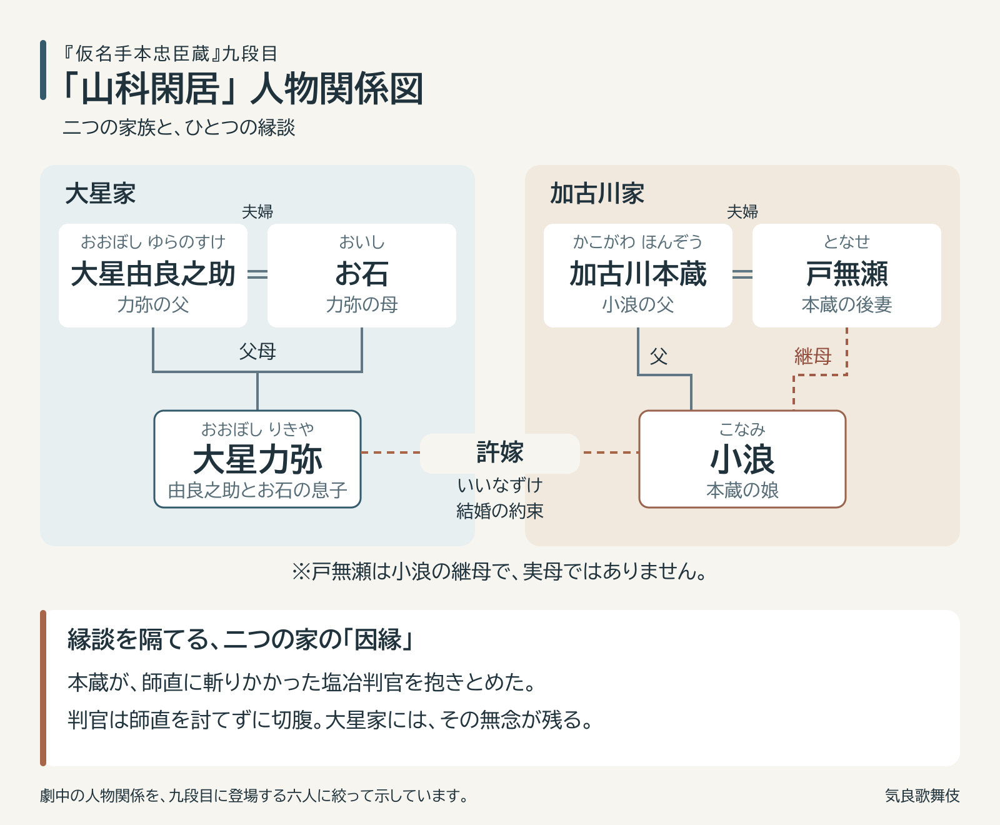

# 【初心者向け】『仮名手本忠臣蔵』九段目「山科閑居」のあらすじ・見どころ｜気良歌舞伎の映像で観る

## はじめに

2026年10月、浅草寺の境内に平成中村座が4年ぶりにやってきます。その十月大歌舞伎の第一部で上演されるのが、『仮名手本忠臣蔵（かなでほんちゅうしんぐら）』の九段目「山科閑居（やましなかんきょ）」です。

『仮名手本忠臣蔵』は、赤穂浪士の討入りを題材にした大作です。竹田出雲・三好松洛・並木千柳の三人による合作で、寛延元年（1748年）8月、大坂の竹本座で人形浄瑠璃として初演されました。そのなかで九段目は、刀を振るう男たちではなく、ある家族の「親心」を描いた一幕です。

「忠臣蔵って長そう」「前の段を知らないとわからないのでは」と感じる方も、どうぞご安心ください。九段目を楽しむために押さえておきたい因縁は、ひとつだけ。上演時間は約90分で、雪の降る静かな家のなかで物語が進んでいきます。

じつは私たち気良歌舞伎も、2021年にこの九段目を上演しました。そのときの映像も、記事の後半でご紹介します。

九段目の主な人物関係。力弥と小浪は許嫁、戸無瀬は小浪の継母です。

## 📖 ざっくりあらすじ

### 雪の山科、仇討ちを期す閑居

舞台は雪の積もる山科。主君・塩冶判官（えんやはんがん）が切腹し、御家は断絶しました。家老だった大星由良之助（おおぼしゆらのすけ、モデルは大石内蔵助）は、仇討ちの日を期して、この地にひっそりと暮らしています。「閑居（かんきょ）」とは、世間から離れた静かな住まいのことです。

### 嫁入りを願う母と娘

その閑居を訪ねてくるのが、戸無瀬（となせ）と娘の小浪（こなみ）。小浪は由良之助の息子・力弥（りきや）の許嫁（いいなずけ）ですが、御家断絶によって縁組は宙に浮いたままです。戸無瀬は小浪の継母。血のつながらない娘のために、なんとか嫁入りを果たさせようとやってきたのです。

ところが、由良之助の妻・お石（おいし）は、この嫁入りをきっぱりと拒みます。

### 断られる理由――父・加古川本蔵

なぜ拒まれるのか。鍵を握るのは、小浪の父・加古川本蔵（かこがわほんぞう）です。三段目、殿中の松の間で、判官が高師直（こうのもろのお）に斬りかかったとき、判官を抱きとめたのが本蔵でした。そのために判官は師直を討ちもらしたまま切腹となり、無念を残しました。大星家にとって本蔵は、主君が本懐を遂げられなかった原因をつくった人物なのです。

九段目を観るうえで知っておきたいのは、この因縁ひとつだけです。

### 思いつめた母、そして虚無僧

嫁入りが叶わないのなら、と戸無瀬は娘を手にかけ、自分も死ぬ覚悟を示します。張りつめた空気のなか、尺八の音色が響き、一人の虚無僧（こむそう、深い編笠をかぶり尺八を吹いて諸国をめぐる僧）が姿を現します。編笠の下にいたのは、ほかならぬ本蔵でした。本蔵は、自らの命を差し出すためにこの家へやってきたのです。

本蔵がどんな思いを抱えてここへ来たのか。由良之助は何を見抜くのか。そして本蔵が最後に託すものが、どのように討入りへつながっていくのか。そこから先は、ぜひ舞台や映像で見届けてください。

**つまり、「娘の幸せのために、母と父がそれぞれ命をかける、雪の日の親心の物語」です。**

## 🌟 ここが面白い！

### 雪の静けさが、緊張を際立たせる

九段目には派手な立廻り（たちまわり、殺陣のこと）はほとんどありません。それなのに、観ていて息が詰まるほど緊張します。その理由のひとつが雪です。降り積もる雪と閑居の静けさが、登場人物たちの張りつめた心をいっそう浮かび上がらせます。音の少ない場面だからこそ、ひとつひとつの台詞や所作が胸に迫ってきます。

### 虚無僧姿の本蔵、命を捨てる覚悟

この段の核心は、虚無僧姿で現れた本蔵が、命を捨てる覚悟を示す場面です。三段目では「判官を止めた人」として恨まれる立場にあった本蔵が、九段目ではまったく違う顔を見せます。忠臣蔵という長い物語のなかで、ひとりの人物の見え方がここまで変わるのか、という驚きがあります。

私自身、気良歌舞伎でこの本蔵を演じました。力弥の槍を受ける場面で、本蔵は自ら槍を脇へと導くようにして受けます。自分の体で本蔵の覚悟をなぞったあの感覚は、今も忘れられません。

### 一枚の図面が、物語を討入りへ動かす

雪の閑居に閉じこもっていた物語は、最後に一気に動き出します。本蔵が託すのは、仇・師直の屋敷の図面。ひとつの家族の物語が、この一枚によって討入りという大きなうねりへと流れ込んでいきます。その瞬間の高揚感を、ぜひ味わってください。

## 🎫 観に行くなら ― 平成中村座 十月大歌舞伎

- **公演**：平成中村座 十月大歌舞伎（浅草寺境内の仮設劇場）
- **日程**：2026年10月1日〜25日（8日・19日は休演、23日は貸切）
- **上演**：九段目は第一部（午前11時開演）。同じ部で『初帆上成駒宝船』『連獅子』も上演されます

- 大星由良之助：中村勘九郎
- 加古川本蔵：中村鴈治郎
- 戸無瀬：中村七之助（初役）
- お石：中村扇雀
- 小浪：中村鶴松
- 力弥：中村歌之助

公演情報の詳細・最新情報は、[歌舞伎美人の公式案内](https://www.kabuki-bito.jp/theaters/other/play/982/)をご確認ください。

### 観劇のポイント

- **イヤホンガイド**：台詞や背景を解説してくれるイヤホンガイドは、初めての方にとても心強い味方です。今回の平成中村座では、会場でイヤホンガイドの貸出機を利用できます。当日レンタルは1台800円。「耳寄屋」の事前予約は700円に発券手数料2％がかかり、電子チケットの提示にスマートフォンが必要です。詳しい利用方法は[イヤホンガイドの公式案内](https://www.eg-gm.jp/news/heiseinakamuraza_2026_10.html)でご確認ください
- **席選び**：平成中村座は仮設劇場なので、座席の配置や舞台の見え方がふつうの劇場とは異なります。九段目は表情や所作で心を伝える場面が多いので、役者の表情が見える席を選べると、より深く楽しめます
- **予習は不要**：この記事で「本蔵と大星家の因縁」さえ押さえておけば十分です。あとは雪の静けさに身を委ねてください

11月には歌舞伎座で『仮名手本忠臣蔵』の通し上演もあり、この秋はまさに「忠臣蔵の秋」です。

## 🎬 気良歌舞伎の映像で観る

私たち気良歌舞伎は、岐阜県郡上市で活動する地歌舞伎（じかぶき、地域の人々が演じ継ぐ歌舞伎）の団体です。2021年、コロナ禍のなかで配信公演「通し狂言 仮名手本忠臣蔵」を行い、この九段目を上演しました。

九段目は、気良歌舞伎でも、一緒に活動する高雄歌舞伎でも、それまで演じたことのない段でした。プロの大歌舞伎でも、上演の多い段ではありません。手元に台本はなく、何十年も前のプロの公演を収めたVHSを繰り返し観て、台詞を一語ずつ書き起こすところから始めました。舞台に降る雪は、紙を手でちぎったものを黒衣（くろご）が降らせています。

撮影を終えたあと、高雄歌舞伎の師匠がこう言ってくれました。

「この場面をずっと演じたかった。でも難しすぎた。今の君たちだからこそ可能になったんだ」

その言葉とともに残った、私たちの九段目です。平成中村座の予習に、あるいは観劇後の余韻に、ご覧いただけたらうれしいです。

▶ 気良歌舞伎『仮名手本忠臣蔵』九段目 山科閑居を観る
https://www.youtube.com/watch?v=KcDDs1XdqSM

本蔵を演じた筆者が、実際に山科の地を訪ねた紀行エッセイもあわせてどうぞ。
「化粧のあとに①閑けさの山科――九段目の加古川本蔵」
https://note.com/kerakabuki/n/nc111a58c0d65

---

📖 **この演目をもっと詳しく**
登場人物の詳しい解説やあらすじの全文は「KABUKI PLUS+」で読めます。
https://kabukiplus.com/kabuki/navi/enmoku/yamashinakankyo

📓 **観劇したら記録を残そう**
「KABUKI RECO」で観劇ログをつけると、あなただけの歌舞伎アルバムが完成します。
https://kabukiplus.com/kabuki/reco

---

#歌舞伎 #kabuki #歌舞伎初心者 #伝統芸能 #日本文化 #観劇 #舞台 #KABUKIPLUS #仮名手本忠臣蔵 #忠臣蔵 #山科閑居 #時代物 #竹田出雲 #平成中村座 #地歌舞伎 #気良歌舞伎

<!-- 画像生成プロンプト
Style: 和風・浮世絵風イラスト、テキストなし
Size: 1200x630
Prompt: A ukiyo-e style woodblock print illustration of a quiet, secluded thatched-roof retreat in Yamashina on a snowy winter day. Snow falling softly and piled on the roof, garden stones and bare branches. On the wooden veranda rest a deep woven straw basket hat of a komuso monk and a bamboo shakuhachi flute, with a long spear leaning against a sliding paper door. Calm, hushed, tense atmosphere. Color palette: deep indigo, sumi ink black, snow white, with small accents of vermilion. Wide horizontal composition. No text, no people.
-->
